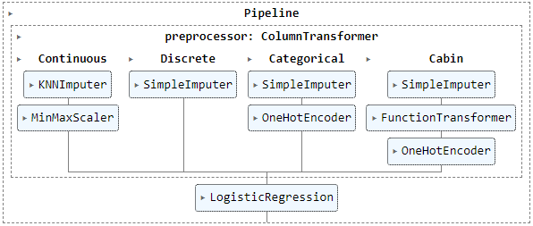

Titanic Survival- Overview
==========================
- Created a generalized template for the Machine Learning problems using sklearn pipelines and column transformer
- Engineered features to make the data more readable and useful
- Created pipelines and column transformer using sklearn
- Selected a Model and the parameters of the pipeline using the GridSearchCV
- Optimized the model using the GridSearchCV

Installation
------------
Following will be required to use the template:
- **Python version:** 3.10   
- **Packages:** numpy, pandas, matplotlib, seaborn, sklearn, pickle, os   

**Data Source:** https://www.kaggle.com/competitions/titanic/data

Usage
-----
This template can be used for different projects by changing the following things:
- New data in the raw folder
- New test data in external folder
- Loading the correct data in the notebooks
- Parameters for the model according to your need
- Custom Function Transformer

Project Structure
-----------------

    ├── LICENSE
    ├── README.md          <- The top-level README for developers using this project.
    ├── data
    │   ├── external       <- Data from third party sources.
    │   ├── interim        <- Intermediate data that has been transformed.
    │   ├── processed      <- The final, canonical data sets for modeling.
    │   └── raw            <- The original, immutable data dump.
    │
    │
    ├── models             <- Trained and serialized models, model predictions, or model summaries
    │
    ├── notebooks          <- Jupyter notebooks. Naming convention is a number (for ordering),
    │                         the creator's initials, and a short `-` delimited description, e.g.
    │                         `1.0-jqp-initial-data-exploration`.
    │
    ├── reports            <- Generated analysis as HTML, PDF, LaTeX, etc.
    │   └── figures        <- Generated graphics and figures to be used in reporting
    │
    └── requirements.txt   <- The requirements file for reproducing the analysis environment, e.g.

Data Information
----------------
The data had the following columns:   
- PassengerId
- Survived
- Pclass
- Name
- Sex
- Age
- SibSp
- Parch
- Ticket
- Fare
- Cabin
- Embarked

Exploratory Data Analysis 
-------------------------
I looked at the distributions of the data. Here are the few highlights from the analysis:

Model Building
--------------
I created the following Column Transformer to handle the data preprocessing:

Then, I attached the Logistic Regression pipeline to the Column Transformer and got the following:

After this, I used the GridSearchCV to try out various preprocessing techniques and model algorithms and got the following model as the result:

And then, I used the GridSearchCV to search through the various parameters to optimize the above model.

Model Performance
-----------------
Here is how the model performed:

License
-------
[MIT License](https://spdx.org/licenses/MIT.html "LICENSE")
